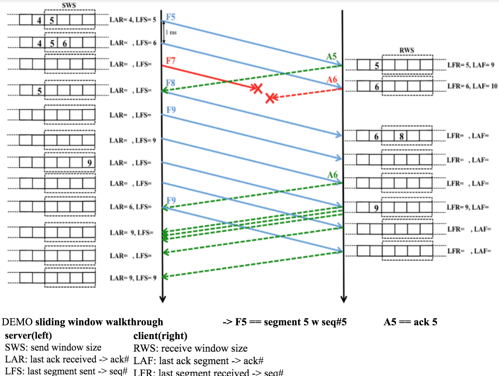
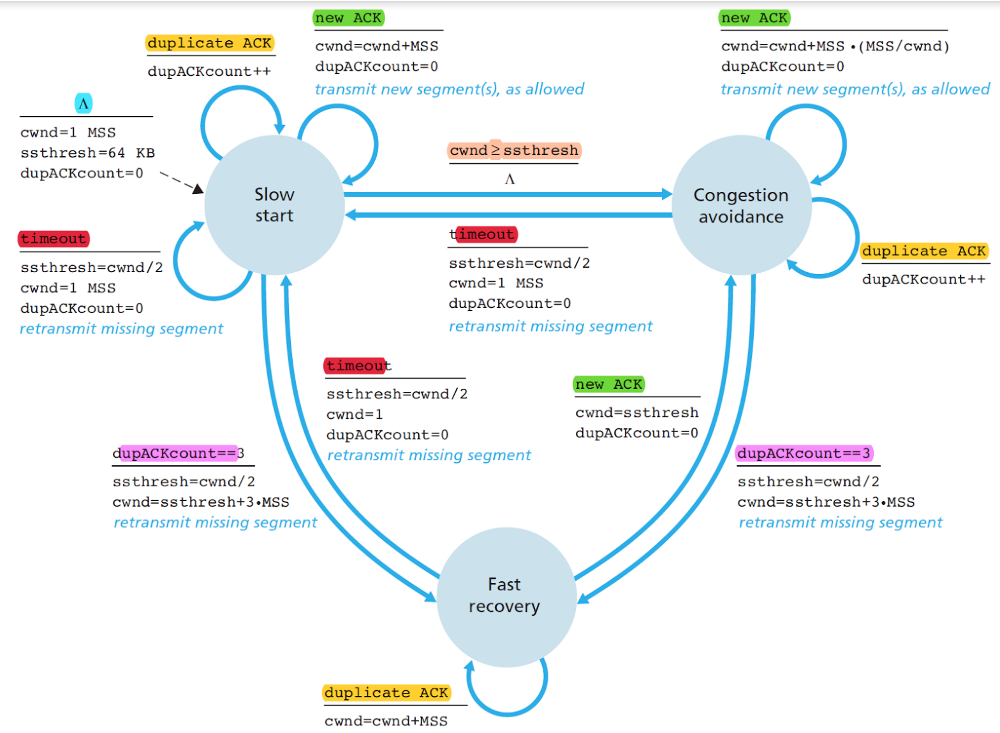

# UDPtoTCP

## Build and run
'''
/* run server process first */
g++ -std=c++14 packet.cc tcpserver.cc server.cc -o server

/* then run client process */
g++ -std=c++14 packet.cc tcpclient.cc client.cc -o client

// debug mode
g++ -g -std=c++14 packet.cc tcpserver.cc server.cc -o server && g++ -g -std=c++14 packet.cc tcpclient.cc client.cc -o client && gdb server
'''

## What it does
- It starts 2 processes from 2 executables simulating packets communication between 2 nodes
	- 1 is TCP server, 1 is TCP client
	- 2 processes inter-process communication, send packets to each other in same machine via socket interface
	- both server process n client process are making UDP network system calls w TCP control flow

- It implements handshake, sliding window protocol, retransmission(mix of go back n and selective repeat), congestion control Reno n Tahoe
	- TCP socket stack implemented on application level 
	- Abstraction of TCP networking system call using UDP networking system call
		- e.g. listen(), accept(), recv() etc. -> TCP system call, it is stateful w "connection/fd" data struct
		- e.g. handshake -> "connection/fd" data struct

## software structure
1. packet.cc
	- byte_array init, seq# flag init, rule of 3 init
	- turn packet struct into uint8_t byte array 
2. tcpclient.cc
	- UDP client socket syscall
	- handshake data struct
	- tcp data struct
3. tcpserver.cc
	- UDP server socket syscall
	- handshake data struct
	- tcp data struct
4. client.cc
5. server.cc

## OS socket implementation layer

## handshake

- handshake data struct
	- handshake is blocking
		- e.g. TCP accept(), connect() is blocking
	- everytime when server receives SYN packet, init handshake data struct
		- TCP server is vulnerable for this attack where attacker keeps sending just SYN packet. This overwhelms memory with handshake data struct
		- handshake data struct is not connection data struct(fd)
- receive packet other than SYN or ACK from another TCP_client
	- store received packets to deal w in next iteration
- timeout 
	- clean up handshake data struct

	
## sliding window flow control + retransmission policy: go back n, selective repeat)

why sliding window
- stop n wait -> demo using ACK packet to flow control 
- sliding window -> stop n wait w N packets to make flow control transfer efficient 

retranmission if:
- timeout -> set_timeout()
- checksum

retranmission policy
- go back N: 1 loss entire window retransmit
- selective repeat: 1 loss only that 1 retransmit

## congestion control: Reno n Tahoe

## How it works - command, screencap

## Challenges

1. nonblocking recvfrom() - select(), nonblocking socket
and timeout

	fcntl() or recvfrom(MSG_DONTWAIT) vs select() non blocking

	why select() 

	=> polling wastes resources, interrupts elegant, efficient, saves CPU resources

	=> select() / blocking uses sleep and interrupt mechanism, however pure blocking completely puts CPU to sleep, select allows timer

2. divide server files into packets

3. engineer UDP packets, engineer TCP packet from UCP packets - header + data + endianess
 - construct packet from bytearray
 - bit manipulation: turning uint8_t byte array into struct of uint16_t: flag, seq#, ack#, window
 - rule of 3
 - raw dup packet actual construction as reference

4. handshake implementation in accept(), connect() api
	
	send and receive timeout i.e. alert after => setsockopt() vs select()
	server => select() since spawn mulitple client socket, client => setsockopt()

5. Reno FSM implementation in send(), recv() api

6. TCP and Packet class + data structure design
	TCP: class => subclass => each server socket 1 TCP, client socket is only map
	Packet: a class instead of struct => varities of packets construction needed

	list vs vector vs map depending on data structure operations needs

	map:
	implemented using red-black tree

7. packets from mulitple clients
- use select() as timer -> check expected packet(s) from all packets received, retransmit 
- TODO: multi-thread to timer-retransmit packets from multiple clients, right now packets from other clients store are stored in a map

# 

> ### Read more on [Tahoe](https://github.com/gothinkster/realworld-example-apps)

&nbsp;&nbsp;

